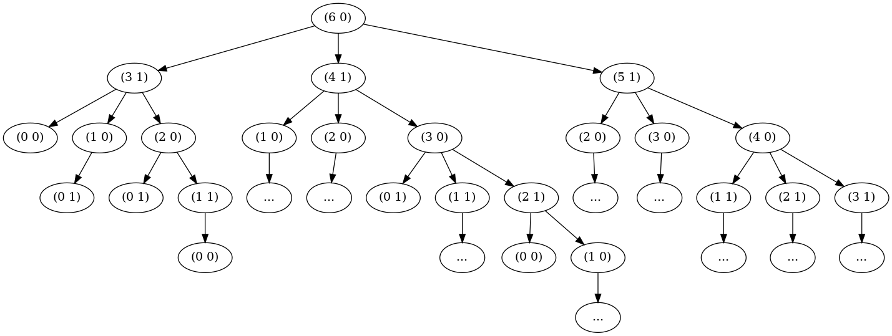
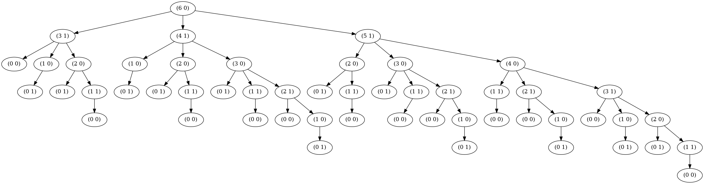

# nim-tree-drawer

Code qui dessine l'arbre des possibilités pour le jeu de nim avec des bulles sous la forme (allumettes restantes, joueur actuel)

---

Exemple d'arbre avec répétitions tronquées :

---

Exemple d'arbre complet :

    
    
    

